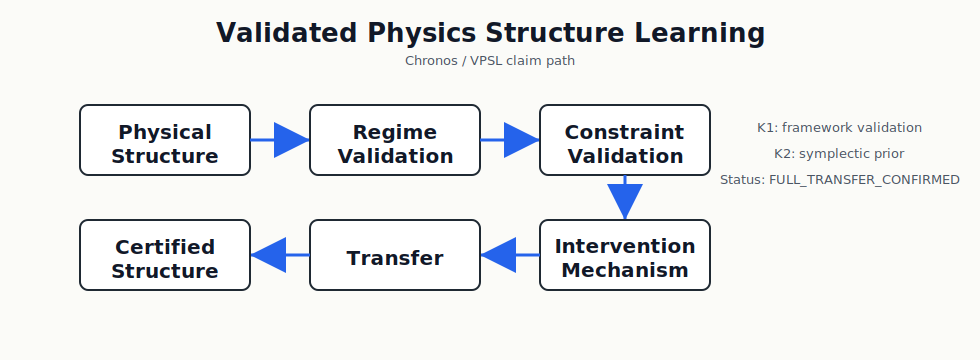

# Chronos

Validated Physics Structure Learning (VPSL)

A framework for discovering, validating, and transferring physics structure
priors.

[](https://github.com/papasop/Chronos-K1/actions/workflows/tests.yml)
[](https://github.com/papasop/Chronos-K1/actions/workflows/k2_syntax.yml)
[](https://colab.research.google.com/github/papasop/Chronos-K1/blob/main/colab/chronos_k1_quickstart.ipynb)

The Colab badge opens the K1 quickstart. K2 archive scripts live under
`chronos/k2/experiments/`.

Current K2 scripts preserve archived verdict logic and summaries. Full Colab
training sources are still being restored.

Chronos-K1 is the first stage of the Chronos VPSL program.

Chronos is the working repository for VPSL: Validated Physics Structure
Learning. It studies whether explicit physical structure can be validated as a
transferable inductive bias under controlled regimes, fair controls, mechanism
checks, and claim boundaries.

This repository is no longer positioned as only a Lorentz / metric-prior
project. The K1 line remains the bounded framework validation stage. The K2
line is the first fully validated physical structure: a symplectic prior on the
FPU-β regime.



## 1. What Is Chronos?

Chronos is a Validated Physics Structure Learning (VPSL) framework.

It determines:

1. When a physical structure should become a learning constraint.
2. Whether its effect is predictive.
3. Whether its mechanism is genuine.
4. Whether its advantage transfers.

Chronos is organized as milestones, not as a single architecture:

- S0: structure recognition / developmental learning layer that recommends
  which physical language should enter VPSL validation.
- K1: framework validation and bounded positive result for spectral /
  Lorentz-structured priors.
- K2: first VPSL-certified structure, validating a symplectic prior on FPU-β.
- K3: topological / winding-density structure search, with negative and
  unresolved regimes recorded.
- K4: gauge / cross-family structure discovery.
- K5: Hilbert / quantum-state representation.

## VPSL Structure Map

Chronos tracks physical structures as validation targets:

| Structure Family | Program / System | Scope | Current Status |
| --- | --- | --- | --- |
| Structure recognition layer | S0 | Selects candidate physical language from diagnostics | `S0_V0_4_PASSED`; emits recommendations, never certifies |
| Pseudo-Riemannian / Lorentz structure | K1 / Klein-Gordon | Geometry, causality, metric signature, light-cone behavior | Partially confirmed; short-horizon evidence, mechanism transfer bounded |
| Spectral / dispersion structure | K1 / Klein-Gordon | Frequencies, dispersion relation, mode dynamics | `BOUNDED_POSITIVE`; coupled with Lorentz-sensitive validation |
| Symplectic / Hamiltonian structure | K2 / FPU-β | Phase space, Hamiltonian flow, long-horizon dynamics | `FULL_TRANSFER_CONFIRMED` through H=240; mechanism transfer confirmed |
| Topological / winding-density structure | K3.0-D / K3.1 candidate | Local topological-charge density, Sine-Gordon winding density | Stage-2 prior test negative: `NO_EFFECT` |
| Gauge structure | K4 candidate | Local symmetry and gauge invariants | Pending |
| Hilbert / quantum-state structure | K5 candidate | Unitarity, quantum-state geometry, Born-compatible diagnostics | Pending |

The repository remains a reproducible research prototype. It does not claim a
solved Physics AI system, a universal architecture, or a proof that every
physical prior improves every task.

Companion historical manuscript:
- `Chronos-K1.txt` (`K=1 Chronogeometrodynamics`)

## 2. Evidence Ladder

VPSL treats a positive result as valid only when the regime, controls,
performance, and mechanism all survive the relevant gates.

| Stage | Result | Status |
| --- | --- | --- |
| S0 | Structure Recognition Layer | `S0_V0_4_PASSED`; recommends K-family, emits `s0_recommendation.csv`, never certifies |
| K1 | VPSL Framework Validation | Done |
| K1 | Spectral Prior | BOUNDED_POSITIVE |
| K2 | Symplectic Prior | FULL_TRANSFER_CONFIRMED through H=240 |
| K3 | Topological / Winding-Density Search | No certified structure yet; K3.1 `NO_EFFECT` |

K1 established a bounded framework result: metric-sensitive behavior appears
under controlled normalization tests, but it is not promoted to a universal
physics-prior claim.

K2 established the first full VPSL transfer result:

- `symplectic < baseline`
- `symplectic < fair energy`
- `symplectic < fair L2`
- mechanism transfer confirmed by full symplectic Jacobian error reduction
- confirmation holds on the graceful-baseline subset, not only pooled rescue
- K2.2-B extended the transfer result to H=240 on the graceful-baseline subset
- K2.3 hardens the result with wrong-Ω controls: the canonical symplectic form
  outperforms shuffled and random antisymmetric 2-form penalties on rollout.
  The wrong-Ω controls under-drive the dynamics, so their raw Jacobian errors
  are treated as degenerate rather than valid mechanism evidence.

## 3. Chronos-S0: Structure Recognition Layer

S0 is the developmental layer of Chronos.

It does not predict physics directly. It observes diagnostic failures and
successes, then recommends which physical representation family should enter
VPSL validation.

S0 asks:

```text
Given a system S, which physical language should the learner try first?
```

- K1: Lorentz / causal language
- K2: Symplectic / Hamiltonian language
- K3: Topological / defect language
- K4: Gauge / local symmetry language
- K5: Hilbert / quantum-state language

S0 never certifies a structure. Certification still requires the VPSL gates:
regime, constraint, mechanism, and transfer validation.

The current S0 guardrail is the K3.2D lesson: low field prediction error is not
enough. A learner may imitate `[Re psi, Im psi]` while failing to transport the
vortex-antivortex pair as a topological object.

Current S0 verdict:

```text
S0_V0_4_PASSED
```

## 4. VPSL Gates

Historically, Chronos was positioned between learned world models and
explicit physics priors. The current repository foregrounds VPSL: a validation
framework for deciding when a physical structure is strong enough to become a
learning constraint.

The current VPSL discipline is:

- Regime validation is a necessary gate before comparing priors.
- Controls must be non-degenerate and fair at the tested horizon.
- Pooled improvements at stress horizons are context only.
- Transfer claims must hold on the graceful-baseline subset.
- Mechanism transfer is required for structure claims.

See:
- `chronos/vpsl/framework.md`
- `chronos/vpsl/gates.md`
- `chronos/vpsl/claim_taxonomy.md`
- `chronos/vpsl/verdicts.md`
- `chronos/vpsl/certified_structures.md`
- `chronos/vpsl/numbering.md`
- `chronos/archive/negative_results.md`

## 5. K1 Archive: Bounded Framework Result

K1 is now treated as the historical framework-validation archive. It studied
whether causal / metric structure can be injected as an explicit inductive bias
in world-model dynamics.

Historical K1 ingredients:

- Lorentz-sign quadratic structure for time / causality.
- Symplectic-dissipative update family.
- Exp6 / Exp7 tests for physics sensitivity and metric specificity.

The strongest K1 evidence remains bounded:

| Experiment | Question | Result |
| --- | --- | --- |
| Exp6 | Does Chronos react differently to timelike vs spacelike data? | Positive sensitivity |
| Exp7 | Is the effect specific to Lorentz normalization? | Lorentz-only interaction, Wilcoxon `p=0.040` |

Detailed K1 materials:
- `k1-manifold-core/`
- `chronos/k1/archive.md`
- `k1-manifold-core/docs/experiment_6_physics_sensitivity.md`
- `k1-manifold-core/docs/experiment_7_metric_controlled_normalization.md`

## 6. K2 Archive: Symplectic Prior

K2 Milestone: the symplectic prior became the first VPSL-certified physical
structure, achieving `FULL_TRANSFER_CONFIRMED` through H=240 on the FPU-β
benchmark.

See:
- `chronos/k2/archive.md`

## 7. Repository Layout

```text
Chronos/
├── README.md
├── REPRODUCE.md
├── MILESTONES.md
├── Chronos-K1.txt
├── archive/
├── chronos/
│   ├── ROADMAP.md
│   ├── archive/
│   │   └── negative_results.md
│   ├── s0/
│   │   ├── README.md
│   │   ├── S0_V0_3_PASSED.md
│   │   ├── S0_V0_4_PASSED.md
│   │   ├── adapters.py
│   │   ├── diagnostics_schema.py
│   │   ├── emitter.py
│   │   ├── run_selector.py
│   │   ├── structure_selector.py
│   │   └── tests/
│   ├── k1/
│   │   └── archive.md
│   ├── k2/
│   │   ├── README.md
│   │   ├── archive.md
│   │   ├── experiments/
│   │   ├── historical_logs/
│   │   ├── reconstruction_notes.md
│   │   └── results/
│   ├── k3/
│   │   ├── K3_NEGATIVE_RESULTS_phi4_regime.md
│   │   ├── README.md
│   │   ├── verdicts.py
│   │   ├── archives/
│   │   ├── experiments/
│   │   ├── negative_results/
│   │   └── results/
│   └── vpsl/
│       ├── framework.md
│       ├── gates.md
│       ├── claim_taxonomy.md
│       ├── verdicts.md
│       ├── certified_structures.md
│       ├── numbering.md
│       ├── structure_claim_template.md
│       └── vpsl_pipeline.svg
├── k1-manifold-core/
└── exp5-diagnostic/
```

The repository name on GitHub may still be `Chronos-K1`; the scientific
positioning is now Chronos / VPSL, with K1 as the historical first milestone.

## 8. Claim Boundary

Supported:

- VPSL framework.
- Regime validation methodology.
- K1 bounded positive result.
- First fully validated physical structure: symplectic prior on FPU-β.

Not claimed:

- All physical priors help.
- All systems benefit from symplectic priors.
- General Physics-AI.
- Chronos is a single architecture.
- K2 generalizes beyond FPU-β yet.
- Pooled rescue at a stress horizon is enough for a structure claim.

## 9. Reproduce Results

Use the reproduction guide:
- `REPRODUCE.md`

K1 benchmark entrypoints live under:
- `k1-manifold-core/benchmarks/`

K2 entrypoints live under:
- `chronos/k2/experiments/`

## 10. Roadmap

See the program roadmap:
- `chronos/ROADMAP.md`

Current program:

- K1: Framework Validation - done.
- K2: First Certified Structure - done.
- K3: Topological attempts - Stage-2 winding-density prior test negative; 2D vortex regime unresolved.
- S0: Structure Recognition Layer - `S0_V0_4_PASSED`.
- K4: Gauge / cross-family structure discovery - future.
- K5: Hilbert / quantum-state representation - future.
