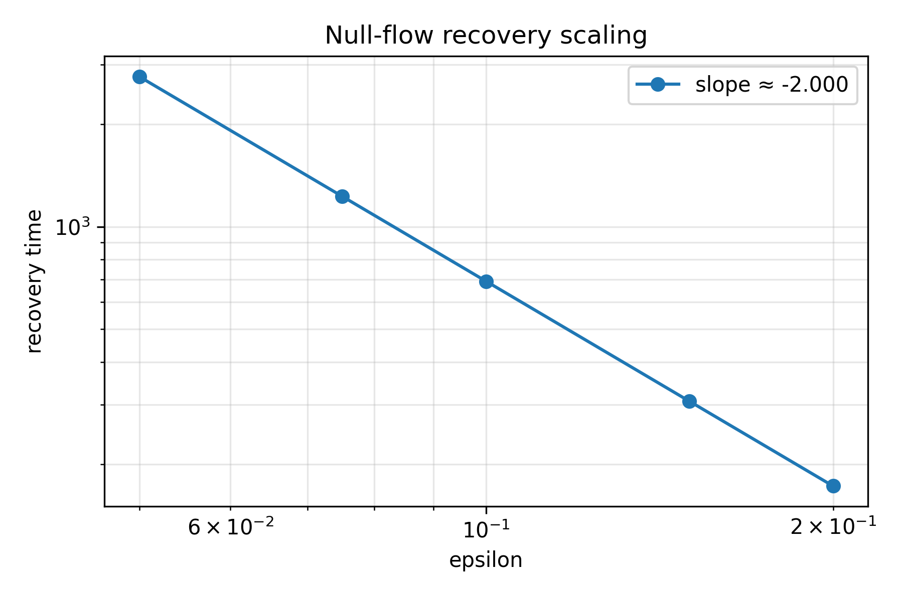

# Chronos-K1

[](https://github.com/papasop/Chronos-K1/actions/workflows/tests.yml)

Chronos-K1 is a Lorentzian structural dynamics framework in which time is
modeled as the cost of structural change and causal structure is encoded
directly into the geometry of a state space.

The current repository is a reproducible research prototype. It contains the
numerical core, tests, and demos needed to inspect the implemented
mathematics. It does **not** claim to derive physical reality, solve world
modeling, or derive general relativity from first principles.

> Companion paper: *K=1 Chronogeometrodynamics — Lorentzian Geometry from
> Information Time, with a Self-Contained Realizability Foundation*
> (see `Chronos-K1.txt` / arXiv / Zenodo). This repository implements and
> numerically verifies the constructions of that paper; it does not extend
> the theoretical claims beyond it.

## Core Idea

Most AI world models learn temporal structure and causality from data.
Chronos-K1 explores a different structural starting point:

- Information time is represented by `dt_info = dPhi / H`.
- Causality is represented by a Lorentzian quadratic form `G`.
- Local structural consistency is the `K=1` manifold, where `K(x) = x.T @ G @ x`.
- Dynamics are a symplectic-dissipative flow, `xdot = (J_G - D) grad V`.
- The critical-damping choice `D = d_c I` is studied as the selection
  mechanism for `K=1` (see *Critical-damping null flow* below).

The single conceptual claim the framework actually argues for is **point-level**:
under realizability axioms (R, E, T) plus nondegeneracy, the leading cost form
`G` is forced to be Lorentzian, `Sig(G) = (1,1)`. Everything downstream
(dynamics, thermodynamics, field-equation reformulation) is either an
algebraic consequence, an added consistency condition, or an explicitly
conditional bridge requiring external inputs.

## What Has Been Implemented

### Lorentzian Signature Verification

Two-dimensional signature checks used by the core package:

- `Sig(G) = (1, 1)`
- `det(G) < 0`
- real spectral threshold `d_c = alpha * sqrt(-1/det(G))`

Tested for canonical and non-diagonal Lorentzian forms.

### Information Time

Verification of `dt_info = dPhi / H` for scalar and vector inputs, with
positive `H`.

### Causal Cone Classification

Classification by the sign of `K(x) = x.T @ G @ x` into timelike, lightlike,
and spacelike, for canonical and non-diagonal Lorentzian forms.

### K=1 Dynamics and the Critical-Damping Null Flow

The framework's Law II / Law III dynamics is `xdot = (J_G - D) grad V` with
`V = 1/2 (K - 1)^2`. At critical damping `D = d_c I`, the generator
`A_c = J_G - d_c I` is **rank-one**, and the implemented tests reproduce the
following structure (canonical form `G = diag(1, -1)`, `alpha = 1`, `d_c = 1`):

- **Null flow.** `A_c = [[-1, 1], [1, -1]]` has `det = 0`, `rank = 1`, and its
  image is the null direction `span{(-1, 1)}`. The drift is therefore confined
  to a null ray:

  ```
  xdot = 2 (K - 1)(x1 + x2) (-1, 1)
  ```

- **First integral.** `c = x1 + x2` is conserved exactly along the flow
  (`d/dt (x1 + x2) = 0`), foliating the plane into invariant leaves
  `{x1 + x2 = c}`. Tests confirm conservation to machine precision.

- **Exact leaf dynamics.** On each leaf the `K`-dynamics is the *linear* ODE

  ```
  d/dt (K - 1) = -4 c^2 (K - 1)   =>   K(t) - 1 = (K0 - 1) exp(-4 c^2 t)
  ```

  Tests fit the decay rate on fixed leaves and recover `4 c^2` with `R^2 = 1`.

- **Freeze leaf.** The single leaf `Sigma_0 = {x1 + x2 = 0}` is exceptional:
  the rate vanishes and `K = 0` everywhere on it, so `K = 1` is never reached.
  `K = 1` is a global attractor on every non-degenerate leaf (`c != 0`) but
  not on all of `R^2`; attraction fails on the measure-zero leaf `Sigma_0`.

- **Recovery-time scaling.** The recovery time to a fixed tolerance scales as

  ```
  T_recover(c) = (1 / (4 c^2)) * log(|K0 - 1| / eps) = Theta(c^{-2})
  ```

  A log-log fit over `c in [0.03, 1]` gives slope `~= -1.99`, `R^2 ~= 1.0`,
  consistent with the `c^{-2}` law up to the logarithmic offset factor.

> These results are established **only** for the canonical 2x2 form. Whether
> `A_c` remains rank-one, with an analogous first integral and `Theta(c^{-2})`
> scaling, for a general 2x2 Lorentzian `G` is an open question (see Roadmap).

### Spherical-Sector Reformulation

The `spacetime` tests use symbolic differentiation to verify the spherical-sector
identities `K_i := sigma_2^2 * Box(ln sigma_i) = 1  <=>  R_mu_nu = 0` for the
Schwarzschild, Reissner-Nordstrom, and Schwarzschild-de Sitter examples.

These are symbolic reformulation checks of an algebraic equivalence, **not** a
general derivation of Einstein gravity. The field-level conditions `K_i = 1`
are an independent ansatz; the point-level null-flow result above provides
dynamical *motivation* for `K = 1`-type conditions but does **not** derive the
field-level `K_i = 1` from them.

### AI World Model Baseline

The first world-model interface is intentionally small: a 2D latent state
`z_t`, an action input `a_t`, an affine transition baseline, and the same
transition wrapped with a `K=1` projection regularizer. The v0.1 benchmark uses
a toy hyperbolic latent sequence with radial off-manifold target noise and
compares:

- one-step prediction MSE,
- long-horizon rollout MSE,
- mean absolute `K` drift.

Run it with:

```
cd k1-manifold-core
python examples/benchmark_world_model_v01.py
```

The result is written to `k1-manifold-core/results/world_model_v01.json`. This
is a minimal latent regularizer benchmark, not a claim about video, robotics,
or large-scale world models.

### AI Benchmarks

The first training-based AI benchmark is an OOD light-cone classification task.
Models are trained on synthetic event differences from `box=2` and evaluated
on larger boxes.

```
cd k1-manifold-core
python benchmarks/ood_extrapolation.py
```

Current OOD AUC summary:

| Test box | Lorentz | Euclid Mahalanobis | Euclid MLP | Lorentz - MLP gap |
| --- | ---: | ---: | ---: | ---: |
| 2 | 1.0000 | 0.7256 | 0.9997 | +0.0003 |
| 4 | 1.0000 | 0.7278 | 0.9997 | +0.0003 |
| 8 | 1.0000 | 0.7213 | 0.9996 | +0.0004 |
| 12 | 1.0000 | 0.7217 | 0.9995 | +0.0005 |

The full output is saved to `k1-manifold-core/results/ood_extrapolation.json`
and the figure to `k1-manifold-core/results/ood_extrapolation_auc.png`. This is
a research benchmark, not a pytest unit test; see
`k1-manifold-core/docs/benchmark_report.md`.

## Repository Layout

```
k1-manifold-core/
  src/k1_manifold_core/
    axioms/
    geometry/
    dynamics/
    thermodynamics/
    spacetime/
    world_model/
  tests/
  benchmarks/
  examples/
  docs/
  lean4/
```

## Quick Start

```
cd k1-manifold-core
python -m pip install -e ".[dev]"
pytest -v
```

If your system Python blocks editable installs because of site-package
permissions, use a virtual environment:

```
cd k1-manifold-core
python -m venv .venv
source .venv/bin/activate
python -m pip install --upgrade pip setuptools wheel
python -m pip install -e ".[dev]"
pytest -v
```

## Run The Demos

```
cd k1-manifold-core
python examples/demo_01_information_time.py
python examples/demo_02_causal_cone.py
python examples/demo_03_k1_attractor.py
python examples/demo_04_recovery_scaling.py
python examples/benchmark_world_model_v01.py
```

The demos generate figures in `k1-manifold-core/examples/outputs/`.
`demo_04_recovery_scaling.py` reproduces the null-flow / freeze-leaf /
`Theta(c^{-2})` results above (rank check, first-integral conservation,
per-leaf exponential fit, log-log recovery scaling).



## Theory Boundary

The repository distinguishes theorem-level code checks, assumptions, and
numerical experiments:

- **Theorem-level checks:** 2D Lorentzian signature tests; `K(x)` evaluation;
  Law II matrix form; rank-one structure of `A_c` and exact-leaf decay rate
  `4 c^2`; spherical-sector symbolic identities.
- **Assumptions:** Axioms R/E/T, nondegeneracy, the added `K=1` consistency
  condition, Law II, Law III, and thermodynamic identifications such as
  `T_eff = T_tol`.
- **Numerical experiments:** local `K=1` attractor trajectories, recovery-time
  scaling, and visualization demos.

No claim is made that the present code derives the full physical spacetime
metric, the matter sector, or general relativity from first principles. The
thermodynamic (Clausius / Jacobson) bridge in the paper is explicitly
conditional on external inputs (`T_eff = T_tol`, `S ~ A`) and is not presented
here as an autonomous derivation.

## Current Status

Chronos-K1 is an experimental research framework. Implemented components are
computational and numerical. Physical interpretations beyond the implemented
mathematics are treated as hypotheses under investigation.

## Roadmap

- General 2x2 Lorentzian `G`: determine whether `A_c` stays rank-one, with an
  analogous first integral and `Theta(c^{-2})` recovery scaling (closing or
  refining the canonical-only results above).
- Characterize the freeze leaf `Sigma_0` and convergence on its complement for
  non-canonical `G`.
- Higher-dimensional Lorentzian state spaces.
- Curved, state-dependent metrics.
- Lean4 formalization of the realizability signature theorem (R/E/T =>
  `Sig(G) = (1,1)`) and the rank-one / first-integral structure.
- Extend the world-model v0.1 latent regularizer benchmark beyond the current
  toy hyperbolic dataset.
- Long-horizon prediction experiments.

See `k1-manifold-core/docs/v0_3_roadmap.md` for the current v0.3
implementation map.

For a one-page reproduction guide, see [REPRODUCE.md](REPRODUCE.md).

## Citation

If you use this code, please cite the companion paper (Y. Y. N. Li,
*K=1 Chronogeometrodynamics*) and this repository. A versioned snapshot with a
DOI will be archived on Zenodo; cite that DOI for reproducibility rather than
the moving `main` branch.

## License

This project is licensed under the MIT License. See [LICENSE](LICENSE).
